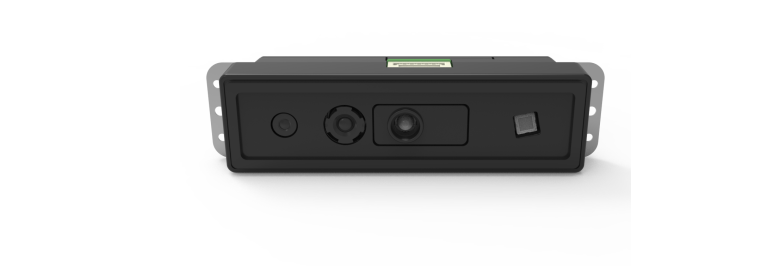
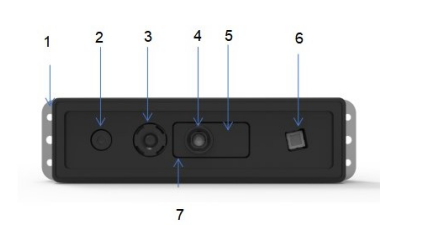
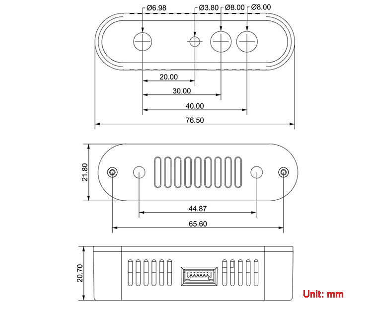

# 1. Introduction to Depth Camera

## 1.1 Overview

The **Aurora 930**, part of the **Deptrum® Aurora 930 Series Depth Cameras**, utilizes **3D structured light technology** to capture the three-dimensional structure of objects and environments. By fusing RGB images from the color camera with depth data, it delivers efficient and convenient **3D perception capabilities**.

## 1.2 Structure

| **No.** | **System Component** |
| :------: | :----------------------------------: |
| 1 | Fixed Wing – Steel Plate (Detachable) |
| 2 | IR Camera(Infrared Camera Module) |
| 3 | RGB Camera(RGB Camera Module) |
| 4 | Infrared Illuminator |
| 5 | Silicone Sleeve (Detachable, replace as needed) |
| 6 | Dot projector |
| 7 | USB Wafer Socket |

## 1.3 Specification

<table  class="docutils-nobg" border="1">
  <tr>
    <th>Category</th>
    <th>Parameter</th>
    <th>Details</th>
  </tr>
  <tr>
    <td rowspan="11">Module Specs</td>
    <td>Overall Dimensions</td>
    <td>76.5*20.7*21.8(mm)</td>
  </tr>
  <tr>
    <td>Baseline</td>
    <td>40mm</td>
  </tr>
  <tr>
    <td>Interface</td>
    <td>USB 2.0 Wafer connector</td>
  </tr>
  <tr>
    <td>Depth Accuracy</td>
    <td>8mm@1m</td>
  </tr>
  <tr>
    <td>Depth Precision</td>
    <td>3mm@0.5m, 7mm@1m</td>
  </tr>
  <tr>
    <td>Working Distance</td>
    <td>30~300cm</td>
  </tr>
  <tr>
    <td>Operating Temperature</td>
    <td>-10℃~55℃</td>
  </tr>
  <tr>
    <td>Operating Humidity</td>
    <td>0% – 95%, non-condensing</td>
  </tr>
  <tr>
    <td>Operating Illumination</td>
    <td>3~80000Lux</td>
  </tr>
  <tr>
    <td>Power Supply</td>
    <td>5V±10%, 1.5A</td>
  </tr>
  <tr>
    <td>Power Consumption Safety Standard</td>
    <td>Average &lt; 1.6W Class 1 Laser Safety Raw 16</td>
  </tr>
  <tr>
    <td rowspan="5">Imaging Performance</td>
    <td>Depth Data Format</td>
    <td>640*400 (320*240) /5~15fps/ H71° x V46° NV12</td>
  </tr>
  <tr>
    <td>Depth Resolution / Frame Rate</td>
    <td>640*400 (320*240) /5~15fps/ H71° x V46° Raw 8</td>
  </tr>
  <tr>
    <td>Color Data Format</td>
    <td>640*400 (320*240) /5~15fps/ H71° x V46°</td>
  </tr>
  <tr>
    <td>Color Resolution / Frame Rate</td>
    <td>640*400 (320*240) /5~15fps/ H71° x V46°</td>
  </tr>
  <tr>
    <td>Infrared Data Format IR Resolution/ Frame Rate</td>
    <td>640*400 (320*240) /5~15fps/ H71° x V46°</td>
  </tr>
  <tr>
    <td>System Compatibility</td>
    <td>Supported Systems</td>
    <td>Linux\armv8\ROSwindows\Android</td>
  </tr>
</table>

Disclaimer:

Please note that individual differences may occur between 3D camera units. The product specifications provided are theoretical and for reference only. Actual performance may vary.