# 2. Configuration and Usage in ROS

<p id="anchor_2_1"></p>

## 2.1 Virtual Machine Installation & Image Import

### 2.1.1 Installing VMware

A virtual machine allows you to run a different operating system within your current one. In this guide, we’ll use **VMware Workstation** as an example. Here's how to get it set up:

(1) Go to the following path: [4.Appendix->Virtual Machine Image->VM Software](Appendix.md) and extract the installation package to your local computer.

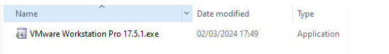

(2) Open the extracted folder and double-click the executable file (with the .exe extension) to launch the installer.

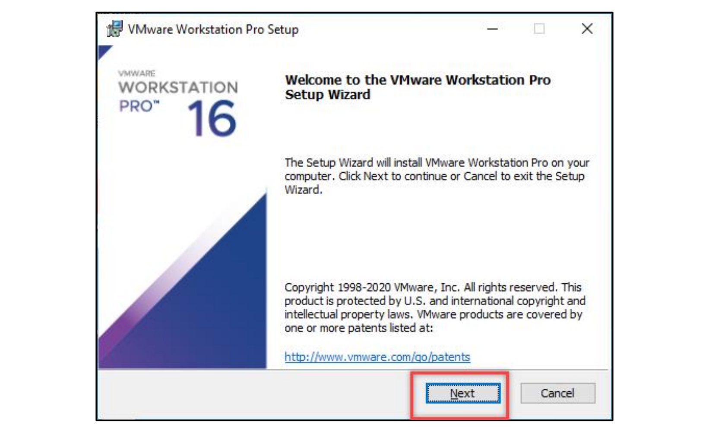

(3) Simply follow the prompts or reference the provided images to complete the installation.

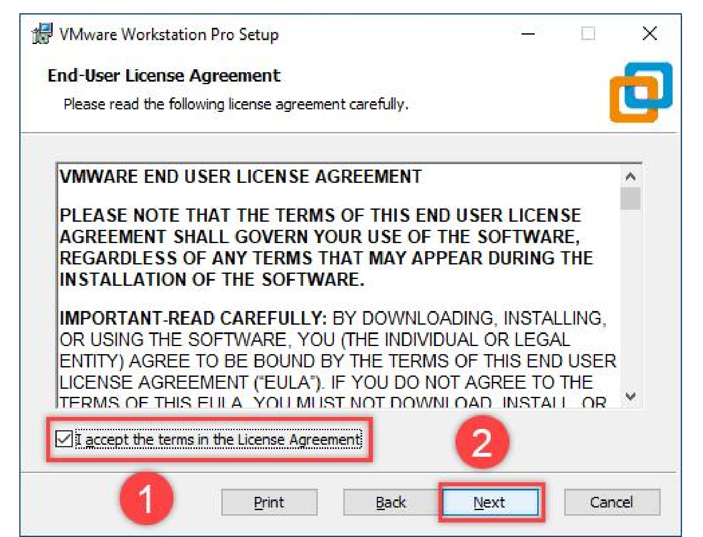

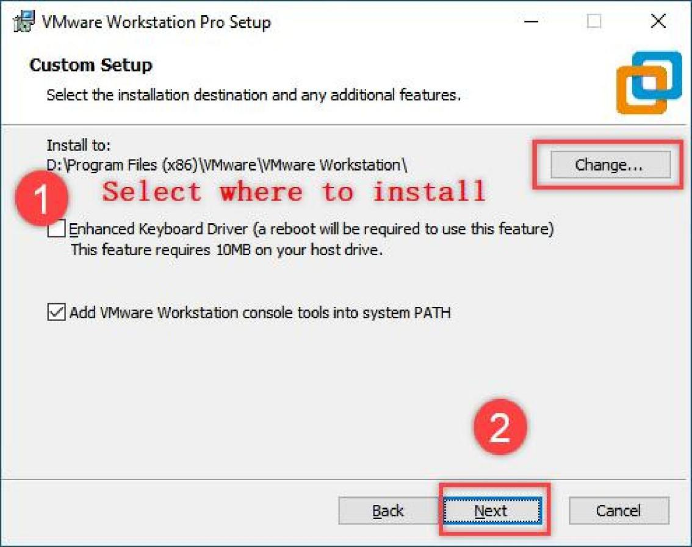

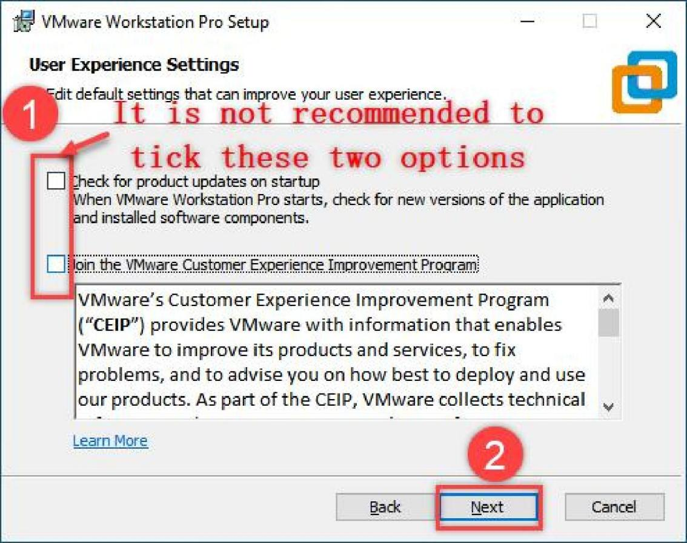

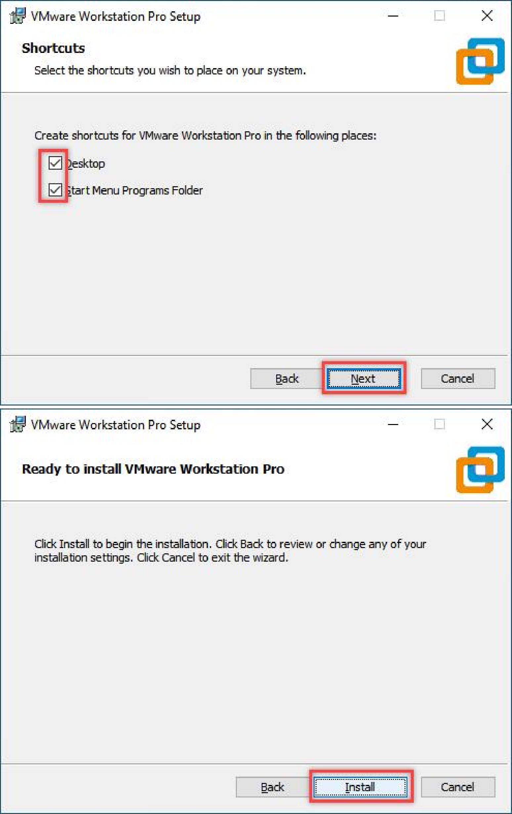

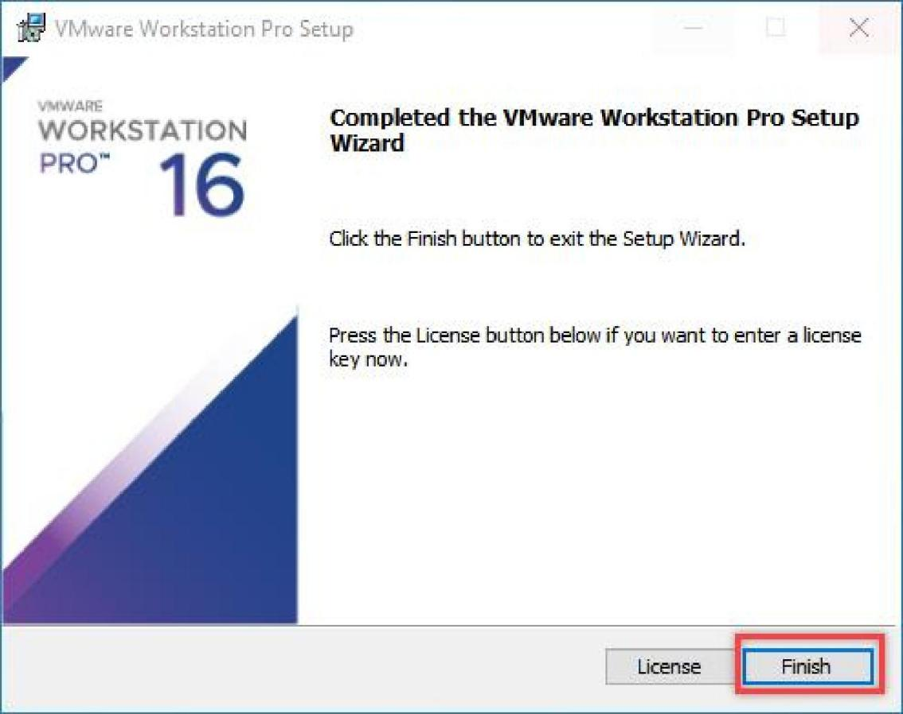

### 2.1.2 Starting VMware-Related Services on Your Local Computer

(1) On your computer, press **Win + R** to open the Run dialog. Type `control` and hit **Enter** to open the **Control Panel**.

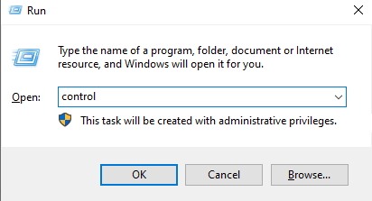

(2) In the **Control Panel**, click on **Administrative Tools**, then double-click **Services** to open the services management panel.

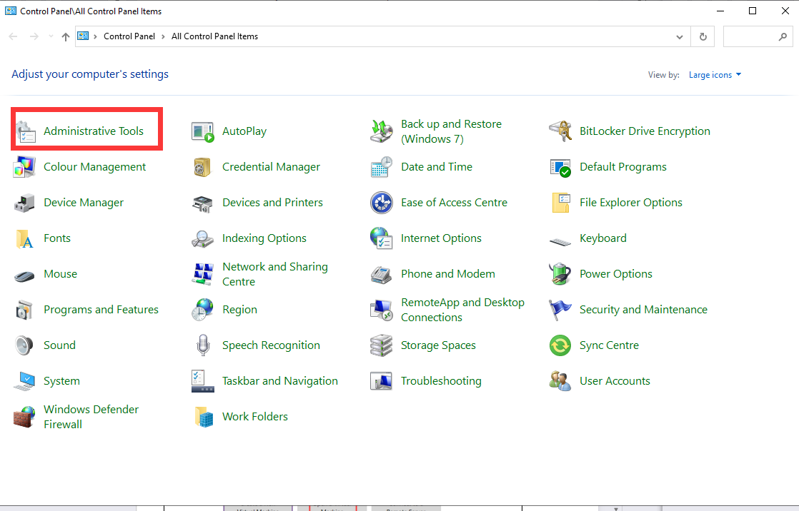

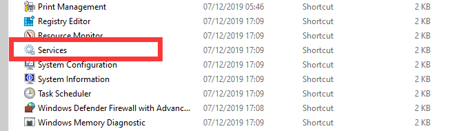

(3) Locate the VMware-related services in the list (as shown in the image below, if available).

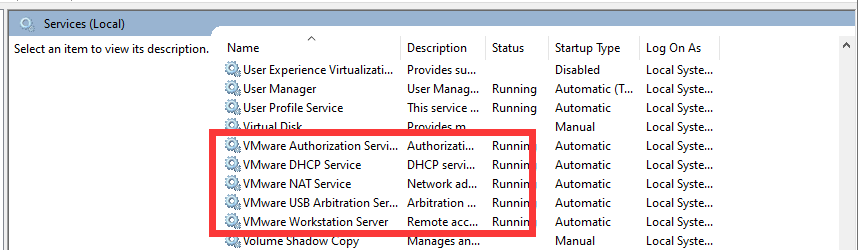

(4) Right-click each service and select **Start** to enable all VMware-related services.

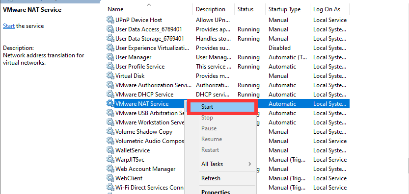

### 2.1.3 Virtual Machine Image Installation

(1) Locate the following folder in the same directory as this document:
[Appendix->Virtual Machine Image->ubuntu_ros1_melodic](Appendix.md)

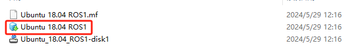

:::{Note}
If you need to import the Ubuntu 22.04 + ROS2 version, use this path instead:
[Appendix->Virtual Machine Image->ubuntu_ros2_humble](Appendix.md)
:::

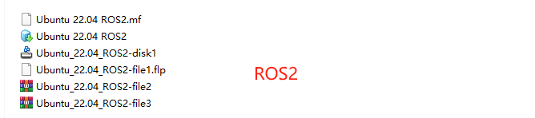

(2) Double-click the virtual machine installer executable (using the ROS1 version as an example).

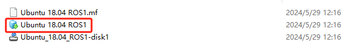

(3) Enter a name for the virtual machine (you can define it yourself) and choose an installation path.

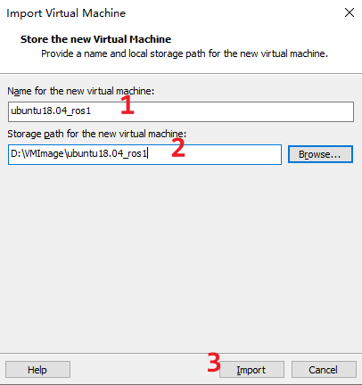

(4) Once the import is complete, click **"Power on this virtual machine"** to start using the installed image.

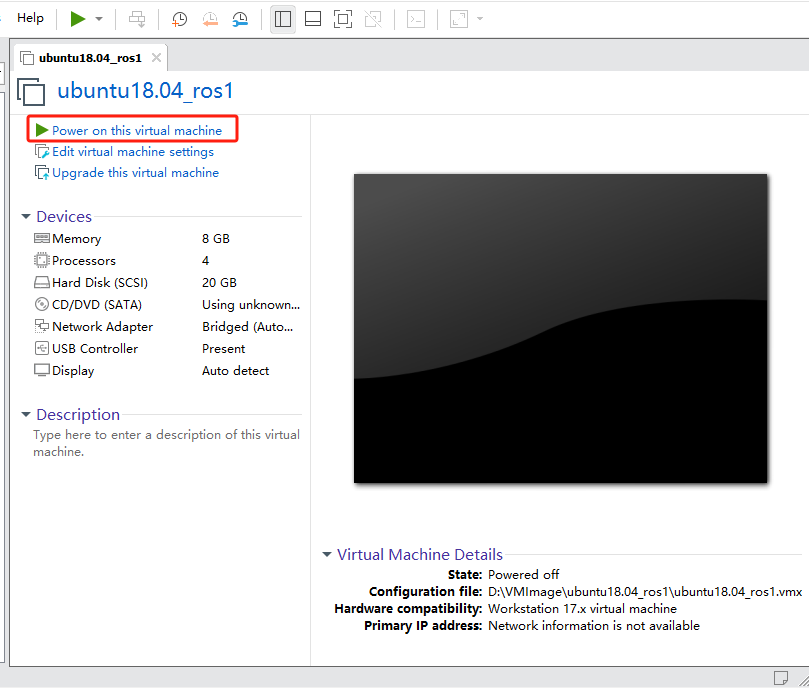

## 2.2 Depth Camera Configuration & Usage in ROS1

### 2.2.1 Preparation

Before getting started, please make sure VMware is installed and the **ROS1 Melodic (Ubuntu 18.04)** image has been imported and set up.
You can refer to [2.1 Virtual Machine Installation & Image Import](#anchor_2_1) for detailed steps.

### 2.2.2 Importing the Depth Camera Package and Setting Up the Environment

* **Importing the Package**

(1) Start the **ROS1 virtual machine** using **VMware**.

(2) Find the depth camera package file located in the same directory as this document:
[package->aurora930_ros1_x86_64.zip](Appendix.md).

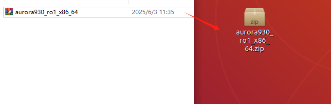

* **Creating a Workspace**

(1) Click the terminal icon 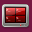 on the left side of the system interface to open a new command-line terminal.

(2) In the terminal, enter the following command to create a new workspace and its src directory:

```bash
mkdir -p ~/ros_ws/src
```

* **Compiling the Package**

(1) In the terminal, enter the following command to unzip the package into the src folder of your workspace:

```bash
unzip aurora930_ro1_x86_64.zip -d ~/ros_ws/src/
```

(2) Navigate to the workspace directory:

```bash
cd ~/ros_ws/
```

(3) Compile the package with the following command:

```bash
catkin_make -DSTREAM_SDK_TYPE=AURORA930
```

(4) After a successful build, open the bash environment configuration file:

```bash
gedit ~/.bashrc
```

(5) At the end of the file, add the following line to include the compiled workspace environment in your system’s bash session:

```bash
source /home/ubuntu/ros_ws/devel/setup.bash
```

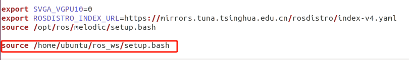

(6) Press **Ctrl + S** to save the file, then close the text editor.

(7) Return to the terminal and reload the bash configuration to apply the changes:

```bash
source ~/.bashrc
```

* **Installing Udev Rules**

Make sure your virtual machine is connected to the internet during this step.

(1) In the same terminal from the previous step, run the following command to navigate to the scripts directory:

```bash
cd src/aurora930_ro1_x86_64/scripts/
```

(2) Run the following script to install the necessary environment dependencies for the depth camera:

```bash
sudo bash install_dependency.sh
```

(3) Then, execute the following command to write the udev rules into the system:

```bash
sudo bash setup_udev_rules.sh
```

(4) Once all the above steps are complete, you can close the terminal.

At this point, the environment setup and package import for the depth camera are successfully completed.

### 2.2.3 Start the Depth Camera

Connect the depth camera to the PC.

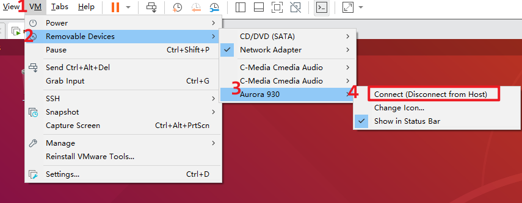

When you find the **Aurora 930** device in the removable devices list, the connection is successful.

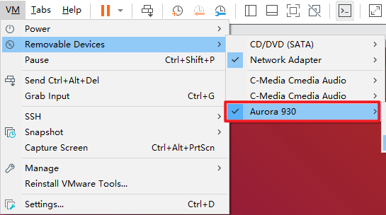

(1) Click the terminal icon 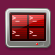 on the left side of the desktop to open a new terminal window, then run the following command to start the depth camera driver:

```bash
roslaunch deptrum-ros-driver-aurora930 driver_aurora930.launch
```

(2) Open another new terminal window following the same steps as above.

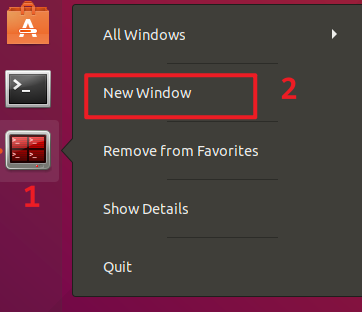

(3) In the new terminal, run the following command to launch RViz and view the depth camera’s image data:

```bash
roslaunch deptrum-ros-driver-aurora930 viewer_aurora930.launch
```

(4) Once the program starts, the interface should appear as shown in the illustration below.

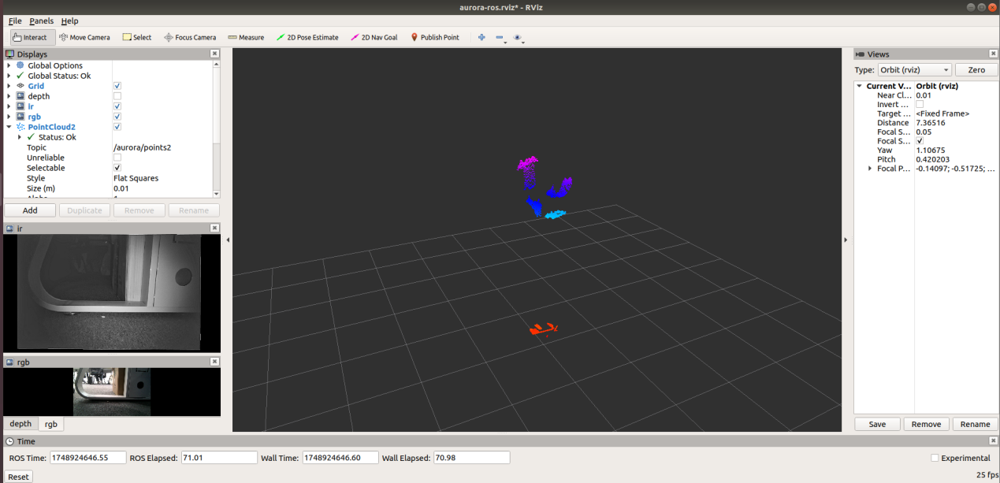

(5) The **IR** (infrared) image and **RGB** image will also be displayed in the window.

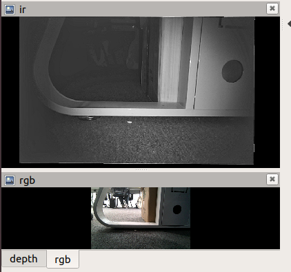

(6) Click on `depth` in the interface to visualize the depth map.

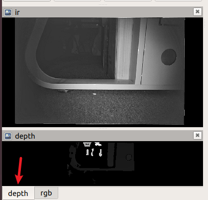

(7) The center area of the interface shows the depth point cloud data.

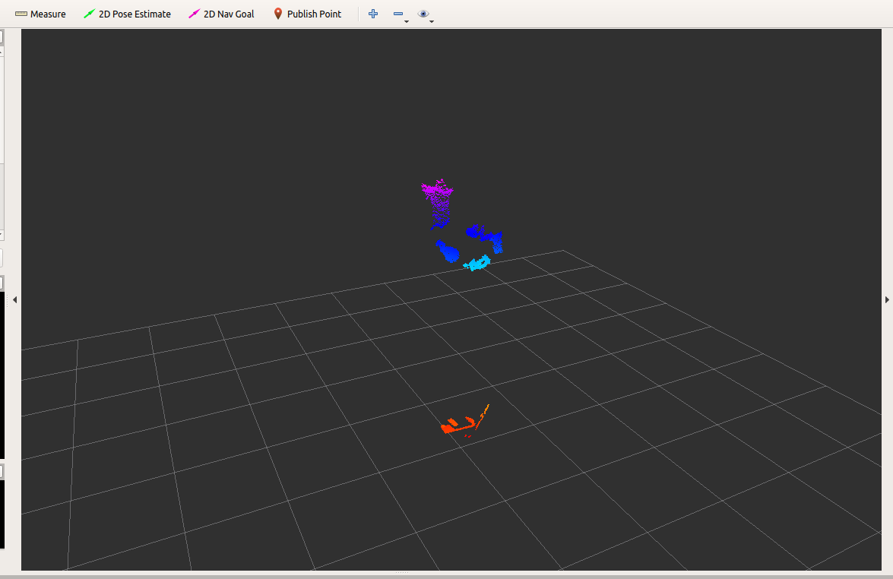

## 2.3 Depth Camera Configuration & Usage in ROS2

### 2.3.1 Preparation

Before getting started, please make sure VMware is installed and the ROS2 humble (ubuntu22.04) image has been imported and set up.
You can refer to [2.1 Virtual Machine Installation & Image Import](#anchor_2_1) for detailed steps.

### 2.3.2 Importing the Depth Camera Package and Setting Up the Environment

* **Importing the Package**

Copy the file [deptrum-ros-driver-aurora930-x86_64.tar.gz](Appendix.md) from the package directory to the **home directory** inside the virtual machine.

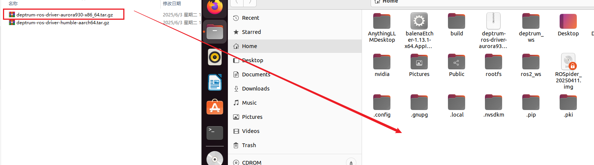

* **Creating a Workspace**

(1) Click the terminal icon 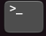 on the left side of the system interface to open a new command-line terminal.

(2) In the terminal, enter the following command to create a new workspace and its src directory:

```bash
mkdir -p deptrum_ws/src
```

* **Compiling the Package**

(1) **Extract the camera package** to the [deptrum_ws->src](Appendix.md) directory:

```bash
tar -xzvf deptrum-ros-driver-aurora930-x86_64-0.2.10-source.tar.gz -C ~/deptrum_ws/src/
```

(2) **Install ROS 2 and the** `ament_cmake` **build tool**:

```bash
sudo apt update
```

```bash
sudo apt install ros-humble-ament-cmake
```

(3) Source the ROS 2 environment variables:

```bash
source /opt/ros/humble/setup.bash
```

(4) Navigate to the `deptrum_ws` workspace and build the package:

```bash
cd ~/deptrum_ws/ && colcon build --cmake-args -DSTREAM_SDK_TYPE=AURORA930
```

(5) After a successful build, open the `.bashrc` file to configure the environment:

```bash
gedit ~/.bashrc
```

**Add the ROS 2 environment variables and the depth camera package setup to your** `.bashrc` **file** to ensure the environment is automatically loaded in future terminal sessions.

```bash
source /opt/ros/humble/setup.bash
source /home/ubuntu/deptrum_ws/install/local_setup.bash
```

(6) Press **Ctrl + S** to save the file, then close the editor.

(7) Return to the terminal and run the following command to reload the environment and verify that it’s been properly configured:

```bash
source ~/.bashrc
```

* **Installing Udev Rules and Connecting the Camera**

(1) Run the script to add the udev rules for the camera. When prompted, enter the Ubuntu password:

```bash
sudo sh ~/deptrum_ws/src/deptrum-ros-driver/ext/deptrum-stream-aurora900-linux-x86_64-v1.1.19-18.04/scripts/setup_udev_rules.sh
```

(2) Plug in the Deptrum camera and verify that it is properly connected.

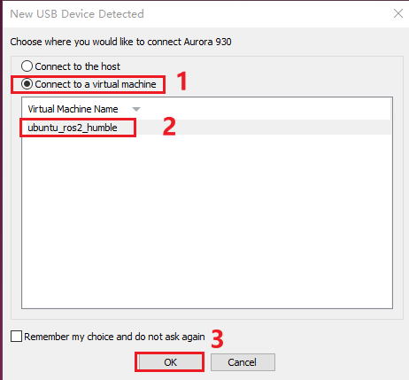

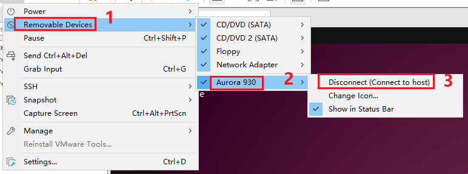

### 2.3.3 Start the Depth Camera

(1) Click the terminal icon  on the left side of the desktop to open a new terminal window, then launch the depth camera package with the following command:

```bash
ros2 launch deptrum-ros-driver-aurora930 aurora930_launch.py
```

(2) Open another terminal window to continue.


(3) Then, run the following command to visualize the depth camera output in RViz:

```bash
ros2 launch deptrum-ros-driver-aurora930 viewer930_launch.py
```

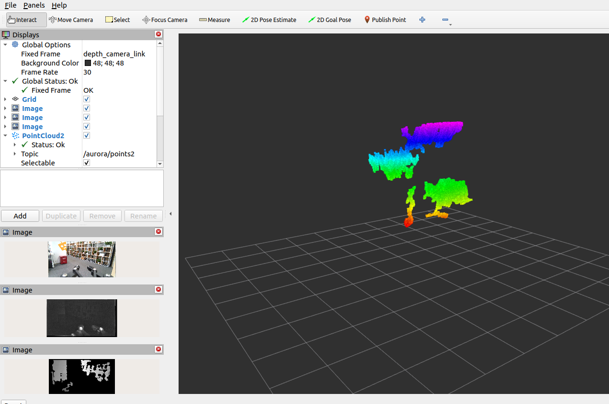

(4) The image in the left respectively indicates:

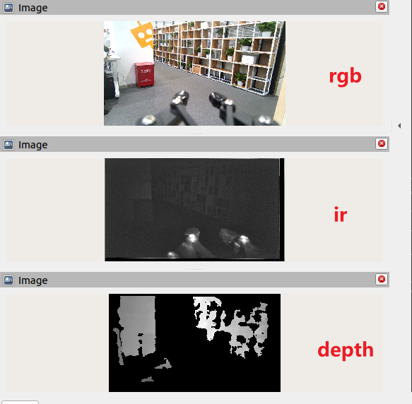

(5) The center of the interface displays the depth point cloud visualization.

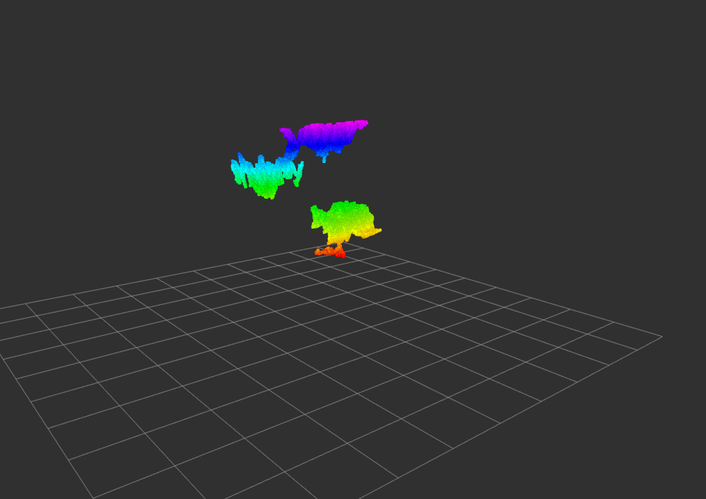