# 3. Configuration and Usage in Windows

## 3.1 Environment Setup

(1) First, unzip the software package: [deptrum-scope-windows-amd64-v3.6.45.zip](Appendix.md)

(2) Install the device driver: Navigate to the `deptrum-scope/driver` folder inside the unzipped package and run [WinUsb-InstallDriver.exe](Appendix.md). Follow the on-screen instructions to complete the installation.

(3) Launch the DeptrumScope application: No installation is required. After connecting the camera module, go to the `deptrum-scope` folder and double-click `DeptrumScope.exe` to start the program.

(4) If you encounter a missing DLL error when running the GUI, try installing the [VC_redist.x64.exe](Appendix.md) (version 2015 or later), then run the program again.

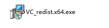

## 3.2 Using the GUI Tool

(1) Connect the camera. The software will automatically detect and connect to the device—this may take a few seconds. Once connected, a device control tree will appear on the left side. If the camera model is not displayed in the top-left corner, the device has not been detected.

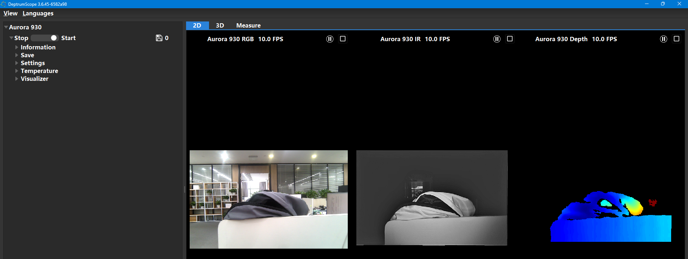

(2) Device information such as the camera model, RGB/TOF firmware versions, serial number (SN), and SDK version will be displayed in the interface.

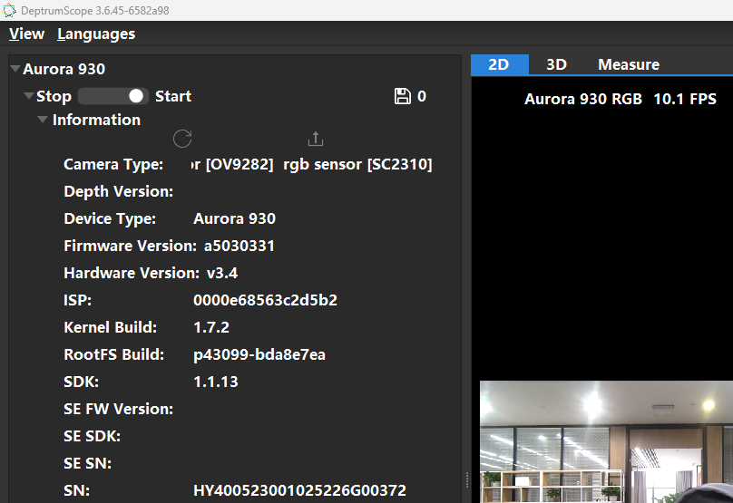

### 3.2.1 2D Mode

(1) Switch to the "2D" tab, then click "Start" under the "Stream & Capture" section to begin viewing the image stream.

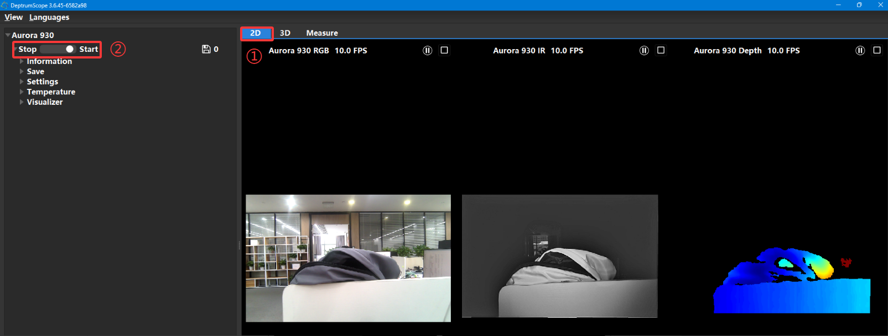

(2) The status bar will display the device type and the current frame rate (FPS).

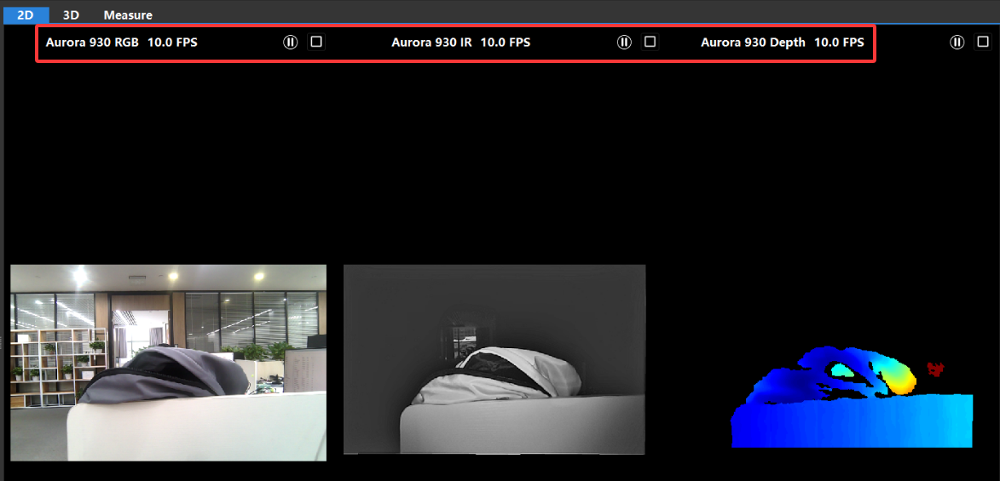

(3) To save an image, click the capture button in the "Stream & Capture" section.

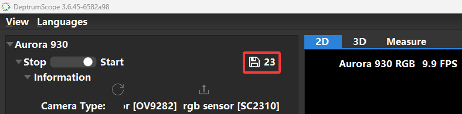

(4) Left-click on the depth map to display the depth value of a specific point. Right-click to cancel the selection. (As shown in the image below.)

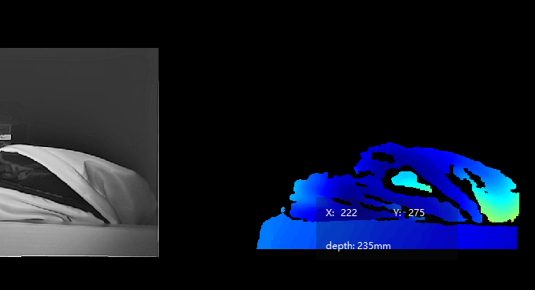

### 3.2.2 3D Mode

(1) Switch to the "3D" tab, then click "Start" in the "Stream & Capture" section to view the live point cloud along with the coordinate axes and field of view (FOV).

If the stream is already running, the point cloud will appear automatically.

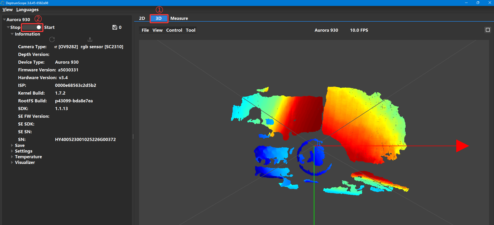

(2) Use mouse drag and scroll to adjust the viewing angle and zoom level of the point cloud.

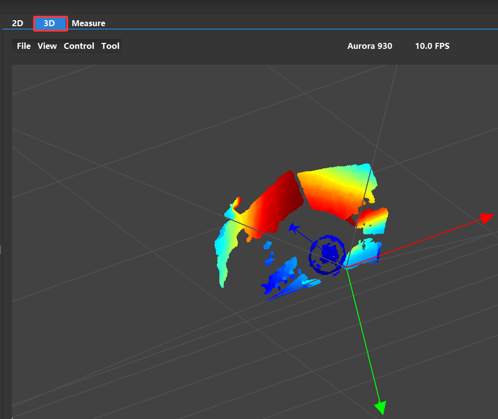

(3) Click "Reset" to return the 3D preview to its default view.

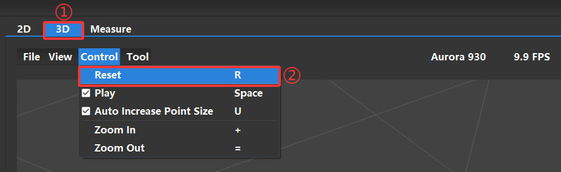

(4) Uncheck "Play" to pause the point cloud display.

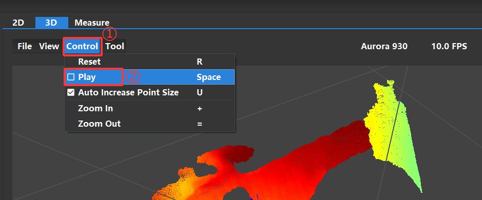

(5) Adjust the "Point Size" value to change the size of the point cloud points in real time.

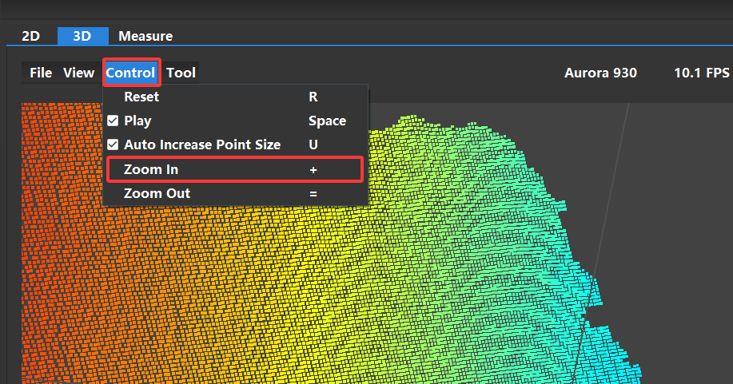

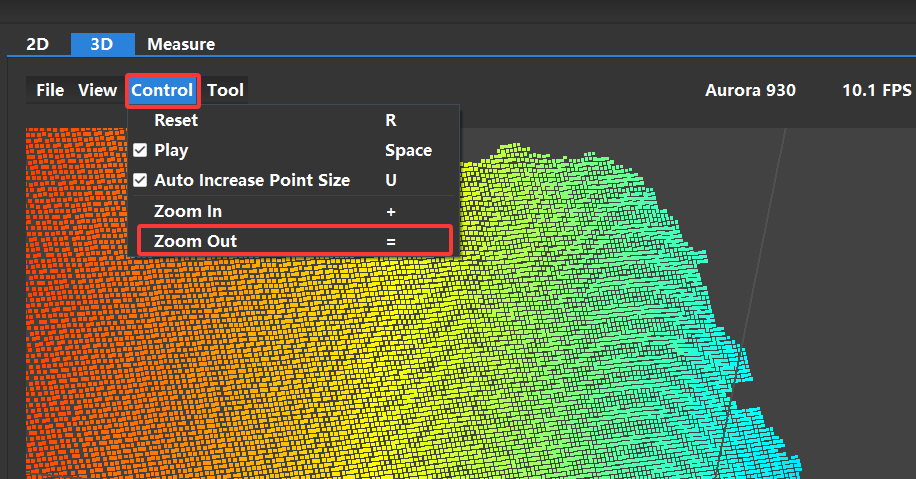